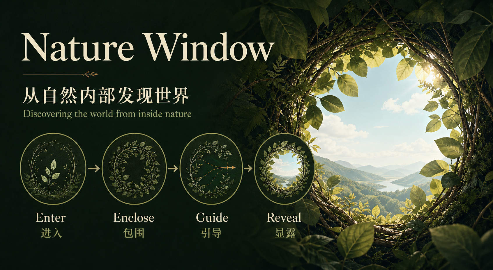

# sayelf-nature-window

> **进入自然，不是站在自然之外观看。**
> **Enter nature instead of observing it from outside.**

`Nature Window` 是一个面向 AI Agent 的自然视觉叙事 Skill。它将一种稳定的自然摄影视觉机制封装为可调用、可组合、可扩展的提示词能力，让 Codex、Claude Code、WorkBuddy 等 Agent 可以通过 MCP、CLI 或 API 直接生成具有统一视觉 DNA、但场景与表达持续变化的中英文图像提示词。

`Nature Window` is an AI-agent-native visual narrative skill for nature imagery. It turns a stable photographic grammar into a callable, composable, and extensible prompt capability. Agents such as Codex, Claude Code, and WorkBuddy can generate Chinese or English prompts through MCP, CLI, or HTTP API while preserving one visual DNA across many different scenes.

## 当前版本 / Current Release

**v0.5.0 — 视觉冲击与智能色彩控制 / Visual Impact & Smart Color Control**

本版本在保持 `Enter → Enclose → Guide → Reveal` 核心机制与既有架构不变的基础上，新增：

- **三档视觉风格**：自然、反差增强、视觉冲击，可在 WebUI、API 和生成器中调用。
- **智能色彩策略**：根据场景色彩家族自动计算饱和度、色相和明亮度，并写入结构化 `color_plan`。
- **版本化更新**：仓库原地持续更新；每次功能更新递增 SemVer 版本号，并同步运行时版本与 Git 标签。后续请以版本号和本节更新摘要为准。

This release preserves the frozen core mechanism and existing architecture while adding three visual-style profiles, automatic saturation/hue/brightness planning, and structured `color_plan` output. Future releases update this repository in place and are identified by an incremented SemVer version and matching Git tag.



---

## 核心机制 / Core Mechanism

```text
Enter → Enclose → Guide → Reveal
进入  →  包围   →  引导  →  显露
```

### 01. Enter / 进入

镜头真正进入自然内部：草丛根部、荷叶下方、竹林地面、枝叶之间、溪谷石缝……

The camera physically enters the environment: beneath grass, lotus leaves, bamboo, branches, ferns, rocks, or other natural structures.

### 02. Enclose / 包围

植物与自然元素占据画面大部分区域，以真实遮挡、层次和空间压迫形成沉浸感。

Natural elements occupy most of the frame, creating immersion through authentic occlusion, layering, and spatial enclosure.

### 03. Guide / 引导

利用枝条、茎秆、叶片方向、尺寸递减、明暗变化和空间节奏，把视线自然引向深处。

Branches, stems, leaf direction, scale reduction, luminance, and depth rhythm guide the eye naturally through the scene.

### 04. Reveal / 显露

最终只留下一个克制的“隐藏窗口”作为视觉出口，并配置一个主要视觉钩子。

A restrained hidden window becomes the primary visual exit, accompanied by one principal visual hook.

---

# 核心价值 / Core Value

普通提示词解决的是：

> **“画什么？” / What should be shown?**

Nature Window 更关注：

> **“观众从哪里进入画面，又在哪里发现它？”**
> **“Where does the viewer enter the image, and where does discovery happen?”**

因此它不是单纯的植物 Prompt 集合，而是一套可以跨场景复用的**视觉空间语法**。

It is therefore not merely a collection of plant prompts. It is a reusable **visual-spatial grammar**.

### 价值 1：统一视觉 DNA / Consistent Visual DNA

不同植物、季节、地点和天气可以变化，但核心观看方式保持一致。

Plants, seasons, locations, weather, and moments can change while the underlying way of seeing remains stable.

### 价值 2：同一场景持续产生不同作品 / Series Generation

同一个荷塘、竹林或雪枝场景可以通过受控变量连续生成不同提示词，而不是机械重复模板。

The same lotus pond, bamboo forest, or winter branch scene can generate many controlled variations instead of repeating a fixed template.

### 价值 3：从 Prompt 模板升级为生成机制 / From Template to Generator

场景不是写死的。Scene Composer 可以根据植物、地点、情绪、窗口和视觉钩子动态构造新的 `SceneSpec`。

Scenes are not hard-coded. Scene Composer can dynamically construct new `SceneSpec` objects from plants, locations, emotions, windows, and visual hooks.

### 价值 4：AI Agent 原生 / AI-Agent Native

Skill 可以与 Codex、Claude Code、WorkBuddy 及其他 Agent 共生，而不是要求 Agent 每次重新理解和编写整套提示词。

The skill coexists with Codex, Claude Code, WorkBuddy, and other agents. Agents call the capability instead of reconstructing the visual logic every time.

### 价值 5：内容扩张，Core 不膨胀 / Content Expands, Core Stays Small

新增场景、植物、季节和变体通过 Plugin/Provider 扩展，不继续向 Core 堆逻辑。

New scenes, plants, seasons, and variations are added through plugins/providers rather than accumulating logic inside Core.

---

## 系统结构 / Architecture

```text
Human / AI Agent
       │
       ├── MCP
       ├── CLI
       ├── HTTP API
       └── WebUI
              │
              ▼
        Core Compiler
              │
     ┌────────┼─────────┐
     │        │         │
   Scene   Variation  Composer
  Provider  Provider   Provider
     │        │         │
     └────────┼─────────┘
              ▼
 Enter → Enclose → Guide → Reveal
              │
              ▼
     Chinese / English Prompt
```

### Core 只负责 / Core Owns

- 冻结视觉语法 / frozen visual grammar
- Prompt 编译 / prompt compilation
- Plugin Contract
- Provider Registry
- 可复现的受控变化 / reproducible controlled variation

### Plugin 负责 / Plugins Own

- 场景库 / scene catalogs
- 植物与生态系统 / plants and ecosystems
- 变体轴 / variation axes
- 动态场景组合 / dynamic scene composition

### Adapter 负责 / Adapters Own

- MCP
- CLI
- HTTP API
- WebUI
- AI Agent integration

---

## 场景系统 / Scene System

当前内置场景覆盖：

- 野花草丛 / Wildflower Meadow
- 秘密花隧道 / Secret Flower Tunnel
- 竹林 / Bamboo Forest
- 荷塘 / Lotus Pond
- 芦苇湿地 / Reed Marsh
- 雪枝 / Winter Branches
- 秋日枫叶 / Autumn Maple
- 苔藓溪谷 / Mossy Stream
- 麦田 / Wheat Field
- 稻田 / Rice Field
- 向日葵丛 / Sunflower Field
- 樱花 / Cherry Blossom
- 紫藤 / Wisteria
- 蕨类森林 / Fern Forest
- 松林 / Pine Forest
- 白桦林 / Birch Grove
- 雨后竹林 / Bamboo After Rain
- 芭蕉林 / Banana Grove
- 茶园 / Tea Garden
- 薰衣草 / Lavender
- 绣球花 / Hydrangea
- 山茶花 / Camellia
- 海岸草坡 / Coastal Grass
- 高山草甸 / Alpine Meadow

场景库只是 Provider，不是系统边界。

The scene catalog is a provider, not the boundary of the system.

---

## 受控变化 / Controlled Variation

同一场景可以沿多个维度变化：

```text
Time
× Weather
× Camera Micro-position
× Window Shape
× Foreground Occlusion
× Depth Rhythm
× Seasonal Trace
× Hook State
× Decisive Moment
```

核心机制不参与随机化：

```text
Enter → Enclose → Guide → Reveal
```

因此得到的是：

> **同一种视觉语言，不同的作品。**
> **One visual language, many different works.**

---

## 视觉表现层 / Visual Treatment

在不改变 `Enter → Enclose → Guide → Reveal` 的前提下，生成器现在支持三种可切换的视觉表现档位：

- **自然克制 / Natural restraint**：保持真实曝光、自然层次和克制的色彩关系。
- **反差增强 / Strong contrast**：加强明暗反差、冷暖色温对比与前后景尺度差异，让隐藏窗口从包围中跳出。
- **视觉冲击 / High visual impact**：使用强烈但可信的明暗与色彩对照、夸张近景尺度和明确视觉钩子，形成第一眼冲击与深处发现。

WebUI 默认使用“视觉冲击”，API 可通过 `visual_style` 传入 `natural`、`contrast` 或 `impact`。每次生成还会根据场景主色自动计算饱和度、色相对比和明亮度层次。所有调整只改变光影、色彩、尺度与焦点表达，不改变冻结的 Core Grammar。

---

## Scene Composer

除了选择预设场景，还可以动态组合不存在于场景库中的新场景。

```bash
node interfaces/cli/index.mjs compose \
  --plant bamboo \
  --location mountain \
  --emotion longing \
  --lang zh
```

例如：

```text
竹 + 山地 + 思念
荷叶 + 湿地 + 安静
蕨类 + 森林 + 神秘
草丛 + 海岸 + 自由
```

Composer 只负责构造 `SceneSpec`，最终仍必须经过被冻结的 Core。

The Composer only builds a `SceneSpec`; every result must still pass through the frozen Core.

---

## AI Agent 调用 / AI Agent Usage

### MCP

```text
hidden_window_list_scenes
hidden_window_generate_prompt
hidden_window_one_click
hidden_window_generate_series
hidden_window_compose_scene
```

Agent 可以直接理解类似指令：

```text
用竹林生成一张，中文。
Generate a lotus hidden-window prompt in English.
用蕨类 + 森林 + 神秘感生成一张。
同一个荷塘生成 8 张系列提示词。
随机来一张，中英双语。
```

### CLI

```bash
node interfaces/cli/index.mjs scenes

node interfaces/cli/index.mjs generate \
  --scene lotus_pond \
  --lang zh

node interfaces/cli/index.mjs series \
  --scene bamboo_forest \
  --count 8 \
  --lang bilingual

node interfaces/cli/index.mjs one-click \
  --lang en
```

### HTTP API

```text
GET  /v1/scenes
POST /v1/prompt
POST /v1/one-click
POST /v1/series
POST /v1/compose
```

---

## 快速开始 / Quick Start

```bash
npm install
npm test
npm run web
```

Local WebUI:

```text
http://127.0.0.1:4178
```

MCP:

```bash
npm run mcp
```

---

## 设计原则 / Design Principles

```text
Core small.
Contracts stable.
Content pluggable.
Agents interoperable.
Variation controlled.
Visual grammar frozen.
```

对应中文：

```text
核心最小化
契约稳定化
内容插件化
Agent 共生化
变化受控化
视觉语法冻结
```

新增一个场景，不应该修改 Core。
新增一种植物，不应该修改 Core。
增加一个 AI Agent，不应该修改 Core。
更换图像生成模型，也不应该修改 Core。

Adding a scene, plant, AI agent, or image-generation provider should not require changing Core.

---

## 非目标 / Non-Goals

Nature Window 当前不负责：

- 图像模型账号与密钥管理
- 直接绑定某一家图像生成平台
- 云数据库
- 用户账户系统
- 大型工作流引擎

这些能力应作为外部 Provider 或 Adapter 接入。

These capabilities belong in external providers or adapters.

---

## 一句话 / In One Sentence

> **Nature Window 把“从自然内部发现世界”变成一种 AI 可以调用、组合和持续生成的视觉语言。**

> **Nature Window turns “discovering the world from inside nature” into a visual language that AI can call, compose, and continuously generate.**

---

## License

MIT
